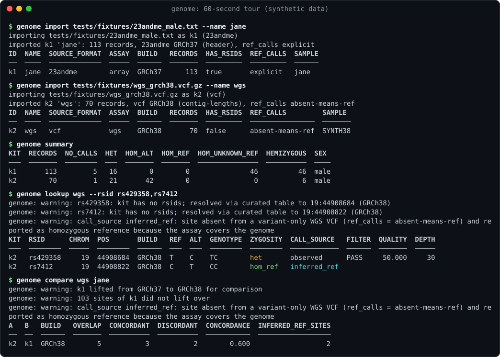

# genome-cli

Rust CLI (`genome`) for personal genomic data: genotyping-array exports,
whole-genome VCFs and raw FASTQ reads, normalized into one genotype model.
Sibling of [biomarker-cli](https://gitlab.com/davidawad/biomarker-cli); feeds
genetics.el through the versioned [`genome/v1` JSON contract](docs/json-schema.md).



## 60-second tour

Real output of the `genome` binary on the repo's synthetic fixtures (no real
person's data): a 23andMe-format export
([`tests/fixtures/23andme_male.txt`](tests/fixtures/23andme_male.txt), GRCh37,
rsids) and a variant-only WGS VCF with no rsids
([`tests/fixtures/wgs_grch38.vcf.gz`](tests/fixtures/wgs_grch38.vcf.gz),
GRCh38). Note APOE `rs7412` resolved by position and reported `inferred_ref`,
and `compare` lifting the array to GRCh38 before scoring concordance.

<!-- sample:tour -->
```console
$ genome import tests/fixtures/23andme_male.txt --name jane
importing tests/fixtures/23andme_male.txt as k1 (23andme)
imported k1 'jane': 113 records, 23andme GRCh37 (header), ref_calls explicit
ID  NAME  SOURCE_FORMAT  ASSAY  BUILD   RECORDS  HAS_RSIDS  REF_CALLS  SAMPLE
──  ────  ─────────────  ─────  ──────  ───────  ─────────  ─────────  ──────
k1  jane  23andme        array  GRCh37      113  true       explicit   jane
$ genome import tests/fixtures/wgs_grch38.vcf.gz --name wgs
importing tests/fixtures/wgs_grch38.vcf.gz as k2 (vcf)
imported k2 'wgs': 70 records, vcf GRCh38 (contig-lengths), ref_calls absent-means-ref
ID  NAME  SOURCE_FORMAT  ASSAY  BUILD   RECORDS  HAS_RSIDS  REF_CALLS         SAMPLE
──  ────  ─────────────  ─────  ──────  ───────  ─────────  ────────────────  ───────
k2  wgs   vcf            wgs    GRCh38       70  false      absent-means-ref  SYNTH38
$ genome summary
KIT  RECORDS  NO_CALLS  HET  HOM_ALT  HOM_REF  HOM_UNKNOWN_REF  HEMIZYGOUS  SEX
───  ───────  ────────  ───  ───────  ───────  ───────────────  ──────────  ────
k1       113         5   16        0        0               46          46  male
k2        70         1   21       42        0                0           6  male
$ genome lookup wgs --rsid rs429358,rs7412
genome: warning: rs429358: kit has no rsids; resolved via curated table to 19:44908684 (GRCh38)
genome: warning: rs7412: kit has no rsids; resolved via curated table to 19:44908822 (GRCh38)
genome: warning: call_source inferred_ref: site absent from a variant-only WGS VCF (ref_calls = absent-means-ref) and reported as homozygous reference because the assay covers the genome
KIT  RSID      CHROM  POS       BUILD   REF  ALT  GENOTYPE  ZYGOSITY  CALL_SOURCE   FILTER  QUALITY  DEPTH
───  ────────  ─────  ────────  ──────  ───  ───  ────────  ────────  ────────────  ──────  ───────  ─────
k2   rs429358     19  44908684  GRCh38  T    C    TC        het       observed      PASS     50.000     30
k2   rs7412       19  44908822  GRCh38  C    T    CC        hom_ref   inferred_ref
$ genome compare wgs jane
genome: warning: k1 lifted from GRCh37 to GRCh38 for comparison
genome: warning: 103 sites of k1 did not lift over
genome: warning: call_source inferred_ref: site absent from a variant-only WGS VCF (ref_calls = absent-means-ref) and reported as homozygous reference because the assay covers the genome
A   B   BUILD   OVERLAP  CONCORDANT  DISCORDANT  CONCORDANCE  INFERRED_REF_SITES
──  ──  ──────  ───────  ──────────  ──────────  ───────────  ──────────────────
k2  k1  GRCh38        5           3           2        0.600                   2
```
<!-- /sample:tour -->

The same lookup for a machine reader: every format shares the versioned
[`genome/v1` envelope](docs/json-schema.md), warnings included.

<!-- sample:json -->
```console
$ genome lookup wgs --rsid rs7412 --format json
{
  "schema": "genome/v1",
  "kind": "genotypes",
  "generated_at": "2026-09-21T14:13:20Z",
  "count": 1,
  "data": [
    {
      "kit": "k2",
      "rsid": "rs7412",
      "chrom": "19",
      "pos": 44908822,
      "build": "GRCh38",
      "ref": "C",
      "alt": [
        "T"
      ],
      "genotype": "CC",
      "zygosity": "hom_ref",
      "call_source": "inferred_ref",
      "filter": null,
      "quality": null,
      "depth": null,
      "lifted_from": null
    }
  ],
  "warnings": [
    "rs7412: kit has no rsids; resolved via curated table to 19:44908822 (GRCh38)",
    "call_source inferred_ref: site absent from a variant-only WGS VCF (ref_calls = absent-means-ref) and reported as homozygous reference because the assay covers the genome"
  ]
}
```
<!-- /sample:json -->

FASTQ is planned (and with `pipeline run`, executed) as align, sort, markdup,
call, filter, normalize and import steps; `plan` is a dry run:

<!-- sample:pipeline -->
```console
$ genome pipeline plan SYN_S1_L001_R1_001.fastq.gz SYN_S1_L001_R2_001.fastq.gz --out run1 --region chr19:44.9M-45.0M --quiet --columns step,tool,status
STEP             TOOL      STATUS
───────────────  ────────  ───────
fetch-reference  genome    planned
index            samtools  planned
index            minimap2  planned
align            minimap2  planned
markdup          samtools  planned
sort             samtools  planned
markdup          samtools  planned
index            samtools  planned
call             bcftools  planned
call             bcftools  planned
filter           bcftools  planned
normalize        bcftools  planned
normalize        bcftools  planned
import           genome    planned
```
<!-- /sample:pipeline -->

Regenerate every sample and the screenshot with
[`scripts/readme-samples.sh`](scripts/readme-samples.sh) (`just readme`);
`cargo test` fails if they drift from what the binary prints
(`tests/readme_samples.rs`); `SOURCE_DATE_EPOCH` pins the JSON
`generated_at`. The session uses the tiny synthetic chain files
from `tests/fixtures` in place of the UCSC ones so it runs offline, which is
why most of the array's sites do not lift.

## Three kinds of data, one model

1. **Array exports** (23andMe, AncestryDNA, MyHeritage, FTDNA): ~600k
   pre-chosen SNPs keyed by rsid, usually GRCh37, + strand. A *subset* of the
   genome; an unlisted site is unknown.
2. **Whole-genome VCF** (e.g. Nucleus, `.vcf.gz`, GRCh38): the derived product
   of sequencing. Usually variant sites only, so an absent covered site is
   homozygous reference; IDs may all be `.`; extra alt/decoy/HLA/EBV contigs;
   possibly a gVCF with explicit reference blocks. **The most important source.**
3. **FASTQ** (raw paired-end reads, tens of GB): no genotypes until aligned and
   variant-called into (2) by `genome pipeline`.

Every call from any of them is one record: chrom/pos/build, ref/alt, genotype
letters on the + strand, zygosity and a `call_source` (`observed`,
`inferred_ref`, `missing`) that makes each kit's "what does absence mean"
semantics (`ref_calls`) explicit. Details: [docs/formats.md](docs/formats.md).

## Tested on real data

Tested against real 23andMe v5 exports and whole-genome VCF/FASTQ from a commercial WGS provider.

A partial-depth or region-limited FASTQ run is only a tooling check; genotype
quality needs all lanes (full ~30x depth). FASTQ-derived variant-only kits are
imported with `ref_calls: unknown`, so an uncovered site is never reported as
reference.

## Quick start

```sh
genome import genome_Jane_v5_Full.txt              # 23andMe; format auto-detected
genome import sample.hard-filtered.vcf.gz --name wgs
genome kits
genome summary wgs                                  # counts, per-chrom, sex inference
genome lookup wgs --rsid rs429358,rs7412            # APOE; no rsids in the VCF -> coordinate table
genome lookup k1 --pos 19:44908684 --build GRCh38   # lifted to the kit's GRCh37
genome compare wgs k1                               # concordance, lifting k1 to GRCh38
genome export wgs --format vcf --region chr19:44.9M-45.0M
genome liftover 19:45411941                         # GRCh37 -> GRCh38
genome pipeline plan R1.fastq.gz R2.fastq.gz --out run1 --region chr19:44.9M-45.0M --max-reads 200000
genome doctor
```

Every command accepts `--format table|json|jsonl|csv|tsv` (`-f`), `--output`,
`--columns`, `--quiet`, `--verbose`. For `import`, `--format` also names the
input format (`auto|23andme|ancestry|myheritage|ftdna|vcf`); for `export` it
selects `vcf|tsv|json`.

## Commands

| command | |
|---|---|
| `import FILE [--name] [--format ...] [--sample] [--build] [--assay] [--ref-calls] [--replace]` | auto-detect, normalize and store a kit (streaming; tested with 5.2M-record `.vcf.gz`) |
| `kits`, `rm KIT` | list / remove kits (`k1`, `k2`, ... or by name) |
| `summary [KIT...]` | no-call/het/hom/hemi counts, `by_chrom` (+ `other_contigs`), sex (PAR-excluded X heterozygosity + Y call rate), caveats |
| `lookup KIT --rsid RS... --pos CHR:POS... [--build]` | genotypes; rsid -> coordinates via the rsid table for kits without rsids; `inferred_ref` for variant-only WGS VCFs |
| `liftover CHR:POS... [--from] [--to] [--chain FILE] [--fetch]` | native UCSC chain liftover; chain files fetched on demand into the cache, sha256-verified |
| `rsid-table [--rsid]`, `rsid-table import DBSNP_VCF [--build]` | bundled curated table; index a dbSNP VCF for full rsid backfill |
| `compare A B [--max-discordant N] [--region]` | concordance on overlapping sites, B lifted to A's build |
| `export KIT --format vcf\|tsv\|json [--region ...]` | |
| `pipeline plan\|run FASTQ... --out DIR [--reference GRCh38\|FASTA] [--region] [--max-reads] [--threads] [--caller bcftools\|deepvariant] [--aligner minimap2\|bwa-mem2]` | FASTQ -> VCF -> kit; see [docs/pipeline.md](docs/pipeline.md) |
| `doctor` | external tools (with `brew install` hints), cached chains/reference/dbSNP, encryption status |
| `db init\|encrypt\|rekey\|unlock\|lock\|status` | encryption at rest (on by default); see [docs/security.md](docs/security.md) |
| `audit log [--limit N]` | verified, encrypted audit trail of commands touching personal data (counts only, no values) |
| `decrypt FILE` | read back `--encrypt-output` exports and `pipeline run --seal` outputs |
| `config show [--effective] \| set \| unset \| path \| keys`, `completions SHELL`, `man [--dir]` | |

### The rsid coordinate table

`data/rsid_table.tsv` (compiled in) maps curated SNPs to GRCh37 and GRCh38
chrom/pos/ref/alt: APOE rs429358 rs7412, MTHFR rs1801133 rs1801131, F5
rs6025, HFE rs1800562, LCT rs4988235, CYP2C19 rs4244285. Every row was checked
against NCBI dbSNP and Ensembl (both builds) and cites them. For any other
rsid on a kit without rsids, index a dbSNP VCF once:

```sh
genome rsid-table import GCF_000001405.40.gz      # GRCh38 dbSNP; GCF_000001405.25 for GRCh37
```

The index (sorted by rsid and by position, 12 bytes/record) lives in
`<cache_dir>/dbsnp/` and is built with bounded memory (external merge sort).

## Configuration

Layers, lowest to highest: built-in defaults < `~/.config/genome-cli/config.toml`
(or `$XDG_CONFIG_HOME`, `--config`, `GENOME_CONFIG`) < `GENOME_*` environment
variables < flags. `genome config show --effective` prints every value with
its source; `genome config keys` lists keys and env names.

| key | env | default |
|---|---|---|
| `data_dir` | `GENOME_DATA_DIR` | `~/.local/share/genome-cli` |
| `db_path` | `GENOME_DB` | `<data_dir>/genome.db` |
| `cache_dir` | `GENOME_CACHE_DIR` | `~/.cache/genome-cli` |
| `format`, `color`, `precision`, `csv_delimiter`, `csv_header`, `null` | `GENOME_FORMAT`, ... | `table`, `auto`, 3, `,`, true, empty |
| `max_discordant` | `GENOME_MAX_DISCORDANT` | 50 |
| `threads`, `aligner`, `caller`, `container`, `reference` | `GENOME_THREADS`, ... | 4, `minimap2`, `bcftools`, `auto`, `GRCh38` |
| `reference_grch37`, `reference_grch38` | | optional FASTA (+`.fai`) used to fill reference alleles for `inferred_ref` and array sites |
| `ucsc_url`, `reference_url`, `offline` | `GENOME_OFFLINE` | UCSC goldenPath, NCBI no-alt set, false |
| `kek` | `GENOME_KEK` | `auto`: key source for new encrypted databases (`GENOME_KEY`, else OS keyring, else prompt) |
| `insecure_plaintext` | `GENOME_INSECURE_PLAINTEXT` | false; store data unencrypted (warns every run) |

## Encryption at rest

Everything genome-cli writes under `data_dir` is encrypted by default with
XChaCha20-Poly1305: the kit database (a sealed container, loaded into an
in-memory fsqlite database, so no plaintext WAL or journal ever exists), every
genotype store (chunked AEAD, so lookups stay random-access) and an
append-only, hash-chained audit log. A random per-database key is wrapped by a
key from the macOS Keychain / Linux Secret Service, from `GENOME_KEY` (CI), or
from an Argon2id passphrase prompt. Plaintext only with `--insecure-plaintext`.
`--output` files with health data print a warning unless `--encrypt-output` is
used. Threat model, formats, key handling, measured cost and the HIPAA note:
[docs/security.md](docs/security.md). fsqlite's documented `PRAGMA
fsqlite.key` does not encrypt in 0.4.9 (tested), which is why genome-cli
has its own encryption layer.

```sh
genome db init                        # encrypted (OS keyring, or GENOME_KEY / passphrase)
genome db encrypt                     # migrate an existing plaintext database in place
genome db rekey --kek passphrase      # new passphrase from GENOME_NEW_KEY or a prompt
genome audit log --limit 20
genome export wgs --format vcf -o wgs.vcf.enc --encrypt-output   # GENOME_EXPORT_KEY or prompt
```

## Storage

Kit metadata (one row per kit, including the precomputed summary) is in a
FrankenSQLite (fsqlite) database, held in memory and sealed to disk (see
above). The
genotype table is **not**. Measured with `examples/fsqlite_bench.rs`
(`cargo run --release --example fsqlite_bench -- N`; release build, one
transaction, x86_64, fsqlite 0.4.9), fsqlite inserted 7,392 genotype rows/s
at 50k rows and 5,313 rows/s at 200k rows (point lookups ~0.26 ms). Insert
throughput falls as the table grows, so a 5M-record WGS VCF would take well over
16 minutes. That is not acceptable for an import. Instead each kit gets a write-once, sorted binary store in
`<data_dir>/kits/<id>/` (`src/gtstore.rs`):

- `sites.bin`: 32-byte records sorted by (contig, pos), binary-searched with
  positioned reads (lookups never load the kit);
- `heap.bin`: rsid/ref/alt/genotype/filter/GT strings;
- `rsid.idx`: sorted (rs number, record) pairs;
- `contigs.json`.

Same machine, a synthetic 5.22M-record `.vcf.gz` (19 MB): `genome import`
takes **10.4 s** with 194 MB peak RSS. The resulting store is 259 MB.
`lookup --pos` takes ~40 ms, and `summary` is instant because it is computed
at import.

## Exit codes

0 ok, 1 error, 2 usage, 3 not found, 4 invalid data, 5 database, 6 io,
7 config, 8 network, 9 external tool, 10 crypto (missing or wrong key,
tampered or corrupt encrypted data). With `--format json` errors are printed
on stdout as `{"schema":"genome/v1","ok":false,"error":{"code":...,"message":...}}`.

## Building

fsqlite 0.4.x uses `#![feature(core_intrinsics)]` on x86_64, so x86_64 needs
a **nightly** toolchain; `rust-toolchain.toml` selects it automatically under
rustup. On aarch64 (Apple Silicon) it builds on stable (e.g. Homebrew's
cargo, which ignores the toolchain file).

```sh
cargo build --release          # target/release/genome
just test-gate                 # fmt --check, clippy -D warnings, tests
genome man --dir /usr/local/share/man/man1
genome completions zsh > ~/.zfunc/_genome
```

## Tests

Synthetic fixtures only (`tests/fixtures`, regenerated by `gen_fixtures.py`):
tiny exports in each array format (male and female 23andMe), GRCh38 and
GRCh37 VCFs with and without rsids and with alt/decoy/HLA/EBV contigs, a
gVCF, and tiny chain files. `tests/pipeline_e2e.rs` simulates read pairs from
a synthetic reference with planted SNPs and runs the real
minimap2/samtools/bcftools pipeline when they are installed (it prints a skip
message otherwise). No real person's genome is fetched or used.

## License

MIT
